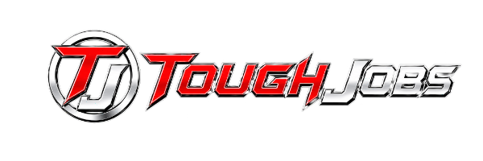

# Toughjobs Project Instructions

## Engineering principles

- **Never add `!important` without asking first.** Ask the user before inserting any `!important` rule. It is a bandaid that masks specificity/ordering problems.
- **Fix root causes, not symptoms.** Prefer solving the underlying problem (remove the offending script, fix the source rule, correct the asset) over layering overrides on top of it.

## 🔓 UNLOCKED (temporary) — user directive, until they say otherwise

The user has instructed that ALL previously-locked files below are unlocked and may
be edited freely without asking per-change permission. This overrides the lock list
until the user says to re-lock them.

- `sticky-cta.js` — the top-right "Start Assessment" badge
- `shared-header.html` — the Universal Header markup
- `shared-header.css` — Universal Header styles
- `inject-header.js` — header injection script
- `trade-base.css` — shared trade-page styles
- `trade-page-template.jsx` — source of truth for all 27 trade pages
- `trade-data.js` — trade content data

A frozen known-good copy of every previously-locked file lives in `_LOCKED/2026-06-30/`.
If a live file gets damaged, restore it from there.
Do NOT edit anything inside `_LOCKED/` — it is the backup of last resort.

## Brand Identity

**Logo**: `assets/toughjobs-monogram-logo.png` — This is the ONLY logo file. Do not create, use, or reference any other logo files (no `toughjobs-logo-static.png`, no `toughjobs-monogram.png`). This logo is used in the nav and footer and must remain consistent across all pages.

**Colors**:
- Primary Red: `#C8262A`
- Dark Red: `#A90100`
- Navy: `#002768`
- Ink (black): `#0A0F1C`
- White: `#FFFFFF`
- Gray background: `#282828`

**Typography**:
- Display/Headlines: "Archivo Black", sans-serif (all-caps, tight tracking), title-text: red or white
- Body/UI: "Archivo", sans-serif (weights 400-800)
- Monospace: system monospace for technical details

## Layout Rules (apply to every page)

**Never let two same-background sections touch.** Adjacent sections must contrast each other — alternate light (white) ⇄ dark (ink/navy). A white section must never sit directly above or below another white section; the same goes for two dark sections. If two same-color sections would end up adjacent, merge them into one or change one's background. Going down a page the backgrounds should visibly alternate.

**Text color contrast — critical for readability:**
- Navy backgrounds (`#002768`) → use white (`#FFFFFF`) or red (`#C8262A`) text ONLY. Never use navy or near-navy text on navy backgrounds.
- Ink backgrounds (`#0A0F1C`) → use white or red text ONLY.
- White backgrounds → use navy, ink, or red text.
- Always test: text must have strong, visible contrast with its background. Blue-on-blue or any color-on-similar-color is unreadable and must be fixed immediately.

## Project Structure
```
v1-quad-cities/
├── index.html              Main homepage
├── services.html           Services page
├── app.jsx                 React app with Tweaks integration
├── components.jsx          All homepage components (Hero, Services, Wraps, Statement, etc.)
├── tweaks-panel.jsx        Tweak controls panel
└── assets/
    ├── toughjobs-monogram-logo.png    ← THE ONLY LOGO
    ├── electrician-hero.png
    ├── girl-saw.png
    ├── wrap-*.png
    └── engineering-schematics.png
```
## Navigation — Canonical Spec (apply to EVERY page)

This is the single source of truth. Every page must match this exactly.

### Structure (left → right)
1. **Logo** — `assets/toughjobs-monogram-logo.png`, 150px wide, 100px tall, links to `index.html`
2. **Nav Links** (main menu, left-to-right order):
   - Trades → dropdown menu listing trade types (electrician, HVAC, plumbing, roofing, contractor, etc.)
   - About → `about.html`
   - Services → `services.html`
   - Partnerships → `partnerships.html`
   - Free Tools → `intake-landing.html`
   - Contact → `contact.html`
3. **Right side** (in order):
   - Phone: `(309) 233-9004` as plain text link to `tel:3092339004`
   - CTA button: "Request a Quote" → `contact.html` (red accent, white text)

### Behavior
- Height: 160px, shrinks 50% on scroll
- Background: ink (`#0A0F1C`)
- Link style: Archivo 700, uppercase, white; hover → red underline + red text
- Active page link gets red underline (permanent)

### Page-Specific Sub-Buttons (BELOW main nav, in the header corners)
These appear only on specific pages — do NOT show on all pages.

**Placement rule (memorize — never place them any other way):**
- **Start Assessment** badge → **top-RIGHT** corner, under the header (`sticky-cta.js`)
- **Go Back** badge → **top-LEFT** corner, under the header (`back-cta.js`)
- On **service detail pages, show BOTH**: Go Back (top-left) + Start Assessment (top-right). They live in opposite corners so they never overlap.

| Button | Page(s) | Style |
|---|---|---|
| **Start Assessment** | Homepage, main marketing pages, service detail pages | Red circular spinning badge, top-right (`sticky-cta.js`) |
| **← Go Back** | Service detail pages (websites.html, local-seo.html, paid-ads.html, etc.) | Red circular spinning badge, top-left (`back-cta.js`) |

### React nav (components.jsx)
Update `navLinks` array to match the canonical order above. The React nav is used by index.html and React-powered pages.

### Plain HTML nav (all other .html pages)
Use this exact HTML block in every plain HTML page. Change only the `active` class to match the current page:

```html
<header>
  <div class="nav-container">
    <a href="index.html" class="logo-link">
      
    </a>
    <nav class="nav-links">
      <div class="nav-dropdown">
        <a href="#" class="nav-link nav-dropdown-toggle">Trades ▾</a>
        <div class="nav-dropdown-menu">
          <a href="#" class="nav-dropdown-item">Electrician</a>
          <a href="#" class="nav-dropdown-item">HVAC</a>
          <a href="#" class="nav-dropdown-item">Plumbing</a>
          <a href="#" class="nav-dropdown-item">Roofing</a>
          <a href="#" class="nav-dropdown-item">Contractor</a>
        </div>
      </div>
      <a href="services.html" class="nav-link">Services</a>
      <a href="about.html" class="nav-link">About</a>
      <a href="services.html" class="nav-link">Services</a>
      <a href="partnerships.html" class="nav-link">Partnerships</a>
      <a href="intake-landing.html" class="nav-link">Free Tools</a>
      <a href="contact.html" class="nav-link">Contact</a>
    </nav>
    <div class="nav-right">
      <a href="tel:3092339004" class="nav-phone">(309) 233-9004</a>
      <a href="contact.html" class="btn">Request a Quote</a>
    </div>
  </div>
</header>
```

> When building a new page, copy the above block verbatim and add `class="nav-link active"` to the current page's link.


## Key Design Elements

### Services Section
- Girl with saw image positioned on LEFT side (`assets/girl-saw.png`)
- Headline: "Four levers / Every one / pulled hard WITH PURPOSE" (right-aligned)
  - "Four levers" — white
  - "Every one" — white
  - "pulled hard" — red
  - "WITH PURPOSE" — red
- 4 service cards in grid with engineering schematic background at 50% opacity
- Cards: Websites, SEO, Paid, Branding
  - Card titles (blurbs): white by default, turn red on hover
- Every page with have Nav Bar.

### Wraps Section

- Headline: "Your fleet is the / biggest billboard / you'll / never pay rent on."
  - "Your fleet is the" — white
  - "biggest billboard" — white
  - "you'll" — red
  - "never pay rent on." — red
- Buttons: "See the wrap gallery" and "Get a wrap quote" — white text, larger font (15px, bold)
- 3 wrap tiles: Trailer (featured left), Service Truck (top-right), Fleet Sedan (bottom-right)
- Stats strip at bottom with 4 metrics
  - Metric numbers: red
  - Metric descriptions: white (changed from gray)

### Statement Section

- Principle statement: "If your site doesn't rank," - white
. It's an expense." - red
  - Main text: white

### Service Area
- Stamp-style city tiles (default)
- 12 cities in 3-column grid
- Each tile: zone code, distance, city name
- Hover: flip to red accent, fade in "Active service zone →"
- Headline: "Central / Illinois. / Boots on the ground."
  - "Central" — white
  - "Illinois." — white
  - "Boots on the ground." — red
- Description paragraph: white text (changed from gray)

## Tweaks System

Users can adjust:
- Palette (navy-led, red-led, mono-accent)
- Accent hue (6 preset colors)
- Headline style (split, solid, outlined)
- Density (spacious, compact)
- Hero variant (photo vs. geometric-typographic)
- City tile style (sweep, stamp, pin, slash)

Tweak defaults stored in `window.__TWEAK_DEFAULTS__` in `index.html`.

## Rules for Editing

1. **ALWAYS read the ENTIRE file** before editing — never use partial reads or assume you know the current state
2. **When the user mentions manual edits**, re-read the full file first to see what they changed
4. **The nav is in `components.jsx`** — do not create separate nav files
5. **Preserve comment anchors** (`data-comment-anchor` attributes) when editing
6. **Use canonical HTML** — close all non-void elements explicitly, double-quote all attributes


## Assets Currently in Use

**Images**:
- `toughjobs-monogram-logo.png` — nav + footer logo
- `electrician-hero.png` — hero background
- `girl-saw.png` — transparent PNG, Services section
- `wrap-truck-erik.png` — Erik Electrical truck wrap
- `wrap-trailer-guacnroll.png` — Guac N Roll trailer
- `wrap-sedan-herbert.png` — Herbert sedan
- `engineering-schematics.png` — Services card grid background
- `insight-*.png` — blog card covers (3)
- `test-pilot-2.webp` - background

## Contact Information

- Phone: (309) 233-9004


## Notes

- Client has manually edited files via Mark Up / Edit tools — always check current file state before changing
- Halftone textures use radial-gradient patterns for visual depth
- All sections use CSS custom properties for colors (set in `app.jsx` based on Tweaks)
